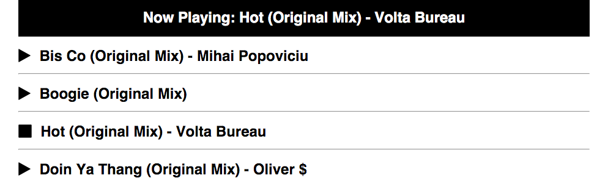

#Javascript Music Player

Using the Audio API, create a functional "MP3 Player"

##Challenge

Your mission, should you choose to accept, is to create a simple Music Player utilizing the Audio API. Your music player must match layout and design of the example player. Be sure to utilize semantic HTML when designing your page. Follow the stories to put together the functionality.

Check out an example player and listen to some Silky Sounds [here](https://js-musicplayer.firebaseapp.com/)

Music Player Example

Music Player w/Track Selected.

###Stories

1. On page load no music should be playing.
2. Banner should read "Select a Song!" when no music is playing.
3. When user selects a song, the banner should change to the current song playing.
5. When a song is not playing, it should have a 'play' icon.
6. When a song is playing, it should have a 'stop' icon.
7. When changing a song, the song last being played should be paused at it's current time.
8. When stopping a song, it should hold the time it was stopped at.
9. When a song finishes playing it should reset itself to the beginning of the track.

##Skills
- jQuery
- DOM Manipulation
- CSS
- Semantic HTML

##Resources
- [MDN Audio Docs](https://developer.mozilla.org/en-US/docs/Web/HTML/Element/audio)
- [Icons](https://fortawesome.github.io/Font-Awesome/)
